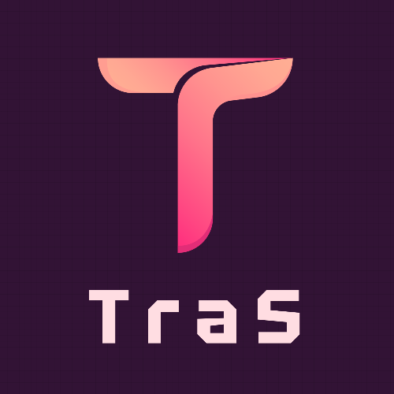
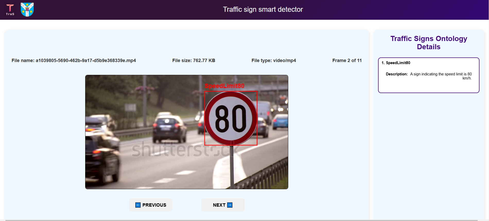
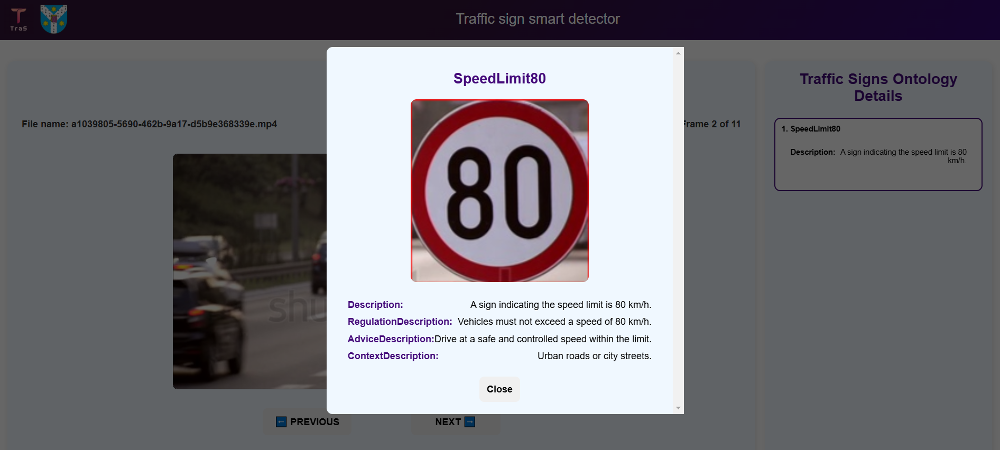

<div align="center">

  
  <h1>Traffic sign smart detector</h1>
  
  <p>
    <b>TraS</b> is a web application developed as part of the evaluation for the Web Application Development discipline.
  </p>

<p>
  <a href="https://github.com/StefanRoman1/TraS/graphs/contributors">
    
  </a>
  <a href="">
    
  </a>
</p>
   
</div>

<br />

<!-- About the Project -->

## :star2: About the Project
The TraS (Traffic Sign Smart Detector) project is a microservice-based web system designed to detect and classify road traffic signs from video recordings. Users can either upload video snapshots or stream webcam footage of urban routes traveled by car, bike, or bus. The system leverages machine learning for automatic sign recognition, enriched by external knowledge sources.

<!-- Screenshots -->
## :camera: Screenshots


<div align="center"> 
  
  
</div>


<!-- TechStack -->
## :space_invader: Tech Stack

  <summary>Frontend</summary>
  <ul>
    <li><a href="https://react.dev/">React</a></li>
    <li>JavaScript</li>
    <li>HTML5</li>
    <li>CSS3</li>
  </ul>

  <summary>Backend</summary>
  <ul>
    <li><a href="https://nodejs.org/en">Node.js</a></li>
  </ul>

<summary>Microservices</summary>
  <ul>
    <li><a href="https://www.python.org/">Python</a></li>
    <li><a href="https://flask.palletsprojects.com/en/stable/">Flask</a></li>
  </ul>

<summary>Database</summary>
  <ul>
    <li><a href="https://blazegraph.com/">Blazegraph</a></li>
  </ul>

<!-- Features -->
## :dart: Features

- Quickly identifies traffic signs from input images or video streams
- Recognizes a wide range of traffic sign categories.
- Intuitive web interface for easy interaction and visualization.

<!-- Color Reference -->
## :art: Color Reference

| Color             | Hex                                                                |
| ----------------- | ------------------------------------------------------------------ |
| Primary Color | #440a7a |
| Secondary Color | #f3f3f3 |
| Text Color | #ffffff #000000 |


<!-- Getting Started -->
# 	:toolbox: Run locally

Clone the repository
```bash
    git clone ssh://john@example.com/path/to/my-project.git 
    cd tras
```

### Database
```bash
    cd blazegraph
    java -jar blazegraph.jar
```

Go to localhost:9999/balzegraph, go to namespaces and create a namespace called trs, then go to update and upload tras_ontology.rdf

### Backend
```bash
  cd ../backend
  npm install
  npm run dev
```

### Microservices
```bash
  cd ../microservices/video_processor
  pip install -r requirements.txt
  python app.py
  
  cd ../yolo_service
  pip install -r requirements.txt
  python app.py
```

### Frontend
```bash
  cd ../../frontend
  npm install
  npm start
```
